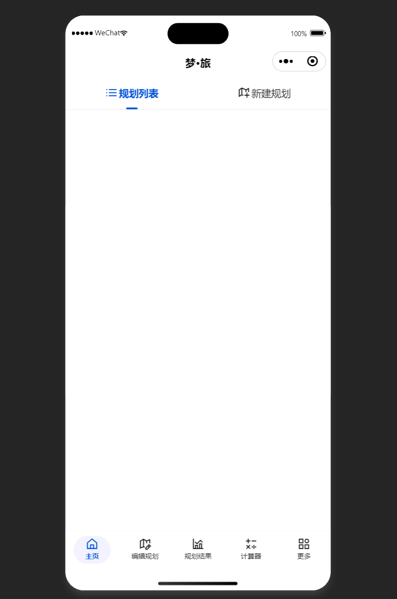

# 《梦·旅》立项报告

### 小组信息

- **组名:** [悸动跑路人](https://github.com/TOKIMEKI-Runners)(TOKIMEKI Runners)
- **组员:** 吉宁岳2022111899([738NGX](https://github.com/738NGX)); 王政选2022110068([devMastermindtai](https://github.com/devMastermindtai))

## 项目功能介绍

本项目基于**微信小程序**平台进行开发,除了实现了基本的四则运算功能之外,主要致力于完成用户在进行旅行规划和复盘时可能出现的各种计算任务.

**"梦·旅"**这个项目名可以解释为"助你实现**梦**想中的**旅**程".本质上这个需求的产生来源于作者本人在出门旅行前总会提前很久就开始做计划,以及在旅行结束后会进行复盘的习惯.考虑到每次这些工作的结构组成编排都大同小异,都有一些共通的内容需要进行计算,于是催生了这个项目的产生.

初步设计上整个应用UI布局如上图所示,底部导航栏包括了五个主要页面,顶部导航栏又包括了若干个子页面.每个子页面对应着一个功能.下面将在介绍页面的同时对项目的各项功能进行介绍.

### 页面A:主页

该页面包含了两个子页面:**行程列表,新建行程**.

#### 子页面A1:行程列表

这个子页面包含了用户已经创建的所有行程,用户可以自由选择进行查看或编辑,或者删除已经不需要的项.

#### 子页面A2:新建行程

这个子页面允许用户从零创建一个全新的行程,也可以拷贝已有的行程或从外部导入行程.

### 页面B:编辑行程

该页面包含了三个子页面:**计划,复盘,设置**.

#### 子页面B1:计划

这个子页面允许用户以模块化的方式进行输入,通过模块化的组合来制定旅游计划并且完成预算和时间安排的输入.

#### 子页面B2:复盘

这个子页面根据计划产生完全一致的输入项供用户输入,以便和计划对比来进行复盘.

#### 子页面B3:设置

这个子页面针对计划中可能出现的设置项(汇率,时区等)进行调整.

### 页面C:规划结果

该页面包含了三个子页面:**文字报告,时间可视化,空间可视化**.

#### 子页面C1:文字报告(附加功能1-7)

该子页面根据用户的输入,完成以下项目的计算并给出一定文字建议:

**费用方面**

- 交通费用计算**(附加功能1)**
- 住宿费用计算**(附加功能2)**
- 餐饮费用计算**(附加功能3)**
- 购物费用计算**(附加功能4)**
- 其他费用计算**(附加功能5)**

**时间方面**

- 时间开销计算**(附加功能6)**

**复盘方面**

- 实际和计划的对比计算**(附加功能7)**

#### 子页面C2:时间视图可视化(附加功能8)

在这个子页面中,将从时间安排方面,对统计计算结果进行可视化.

#### 子页面C3:空间视图可视化(附加功能9)

在这个子页面中,将从空间安排方面,对统计计算结果进行可视化.

### 页面D:计算器

该页面包含了四个子页面:**标准计算器,汇率计算器,时区计算器,日期计算器**.

#### 子页面D1:标准计算器(基础功能)

首先包含了基本的四则运算;具体样式参考各手机厂商的标准计算器来设计.

#### 子页面D2:汇率计算器(附加功能10)

- 用户输入:

    | 变量名   | 输入形式         | 备注    |
    | -------- | ---------------- | ------- |
    | 起始货币 | 选择框单选       | 默认CNY |
    | 目标货币 | 选择框单选       | 默认JPY |
    | 查询金额 | 文本框填充(数字) |         |

- 系统输出:通过向www.mastercard.com.cn发送http请求来查询当前汇率,并最终计算出对应的转换结果.

#### 子页面D3:时区计算器(附加功能11)

- 用户输入:

    | 变量名         | 输入形式     | 备注                                                         |
    | -------------- | ------------ | ------------------------------------------------------------ |
    | 基准城市(时区) | 选组框单选   | 可选是否启用夏令时,默认北京时间UTC+8                         |
    | 基准时间       | 时间格式选择 | 默认系统时间                                                 |
    | 目标城市(时区) | 选组框单选   | 可选是否启用夏令时,可以选择3个目标,默认纽约时间UTC-5;伦敦时间UTC+0;东京时间UTC+1; |

- 系统输出:通过内置时区哈希表完成时区的转换并显示目标城市的对应时间.

#### 子页面D4:日期计算器(附加功能12)

**Mode A**

- 用户输入:

    | 变量名   | 输入形式         | 备注          |
    | -------- | ---------------- | ------------- |
    | 基准日期 | 日期格式选择     | 默认当前日期  |
    | 偏移天数 | 文本框填充(数字) | 负数向前回溯. |

- 系统输出:[基准日期]的(前/后)[偏移天数]天为[输出结果]

**Mode B**

- 用户输入:

    | 变量名   | 输入形式     | 备注           |
    | -------- | ------------ | -------------- |
    | 基准日期 | 日期格式选择 | 默认当前日期   |
    | 目标日期 | 日期格式选择 | 默认明年1月1日 |

- 系统输出:[目标日期]与[基准日期]之间相差[输出结果]天.

### 页面E:更多

这个页面主要是一些软件的信息和设置,无额外具体功能.

## 计划进度

- **9.26-10.2**:设计阶段
    - 需求确定
    - 细化各项统计计算功能设计
    - 完成界面UI布局设计
- **10.3-10.7**:构建阶段
    - 完成基本的程序框架搭建
- **10.8-10.13**:开发与测试阶段
    - 针对具体功能细化开发实现
    - 进行测试,修复潜在问题
- **10.14-10.16**:文档与报告撰写
    - 完成用户文档撰写
    - 完成项目报告撰写